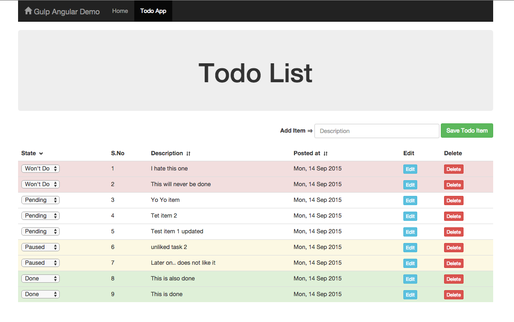

# Angular Demo

Uses `Gulp`, `$Resource`, `ES6 (Code written using Classes)`


## How to run

This project runs a demo server also to serve as backend API to which our angular app communicates using `REST` via `$resource`

One time process. Install dependencies
```
npm install
```

To serve in browser and develop. (This will start backend demo server also :) )
```
gulp serve
```

To Build

```
gulp build
```

## Screenshots




